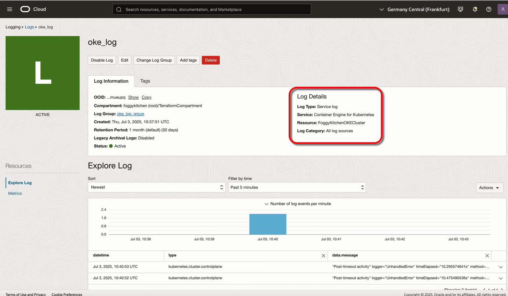

# Lesson 10: Basic Cluster with OCI Logging

This lesson adds OCI Logging to a basic OKE cluster example. It uses the local `terraform-oci-fk-oke` module to create the cluster and its network path, then provisions OCI Logging for control plane log collection through `terraform-oci-fk-logging`.



## What This Lesson Shows

- A basic OKE cluster using the local `terraform-oci-fk-oke` module
- Module-managed network creation through the OKE module itself
- OCI Logging log group creation through `terraform-oci-fk-logging`
- OCI Logging service log configuration for the OKE control plane

This lesson focuses on observability for a minimal cluster path. Unlike lessons 8 and 9, the networking here stays inside the OKE module because the lesson intentionally demonstrates the built-in `use_existing_vcn = false` flow.

## Architecture Notes

This lesson uses:

- the local OKE module via `../..`
- module-managed VCN, subnets, gateways, route tables, and security lists created by `terraform-oci-fk-oke`
- `terraform-oci-fk-logging` for the OCI Logging log group and service log

The OKE cluster is configured in [oke.tf](/Users/mlinxfeld/codes/terraform-oci-fk-oke/training/lesson10_oke_logging/oke.tf), and the logging configuration is in [logging.tf](/Users/mlinxfeld/codes/terraform-oci-fk-oke/training/lesson10_oke_logging/logging.tf).

## Deploy Using Terraform CLI

### Clone The Repository

```bash
git clone https://github.com/foggykitchen/terraform-oci-fk-oke.git
cd terraform-oci-fk-oke/training/lesson10_oke_logging
```

### Create `terraform.tfvars`

Start from the example file:

```bash
cp terraform.tfvars.example terraform.tfvars
```

Minimum required values:

```hcl
tenancy_ocid     = "ocid1.tenancy.oc1..<your_tenancy_ocid>"
user_ocid        = "ocid1.user.oc1..<your_user_ocid>"
compartment_ocid = "ocid1.compartment.oc1..<your_compartment_ocid>"
region           = "<oci_region>"
fingerprint      = "<fingerprint>"
private_key_path = "<private_key_path>"
```

### Initialize Terraform

```bash
terraform init
```

Expected module sources:

- local `../..` for the OKE module
- `terraform-oci-fk-logging` for OCI Logging resources

### Apply

```bash
terraform apply
```

With the current defaults, this lesson creates:

- a basic OKE cluster
- a managed node pool
- a module-created VCN with public control plane, load balancer, and node path
- an OCI Logging log group
- an OCI Logging service log for OKE control plane logging

## Key Configuration

Current cluster settings:

- `cluster_type = "basic"`
- `k8s_version = "v1.35.2"`
- `node_linux_version = "8.10"`
- `node_shape = "VM.Standard.A1.Flex"`
- `node_ocpus = 1`
- `node_memory = 4`
- `use_existing_vcn = false`

Current logging settings:

- log group name: `oke_log_group`
- log name: `oke_log`
- log type: `SERVICE`
- service source category: `all-service-logs`
- service source: `oke-k8s-cp-prod`

## Outputs

This lesson exports:

- `KubeConfig`
- `Cluster`
- `NodePool`

## Destroy

To remove all resources created by this lesson:

```bash
terraform destroy
```

Allow extra time for OKE control plane and node pool teardown before the logging resources are removed.

## Contributing

This project is open source. Contributions are welcome through pull requests.

## License

Licensed under the **Universal Permissive License (UPL), Version 1.0**.
See [LICENSE](../../LICENSE) for details.

---

© 2026 [FoggyKitchen.com](https://foggykitchen.com) - Cloud. Code. Clarity.
