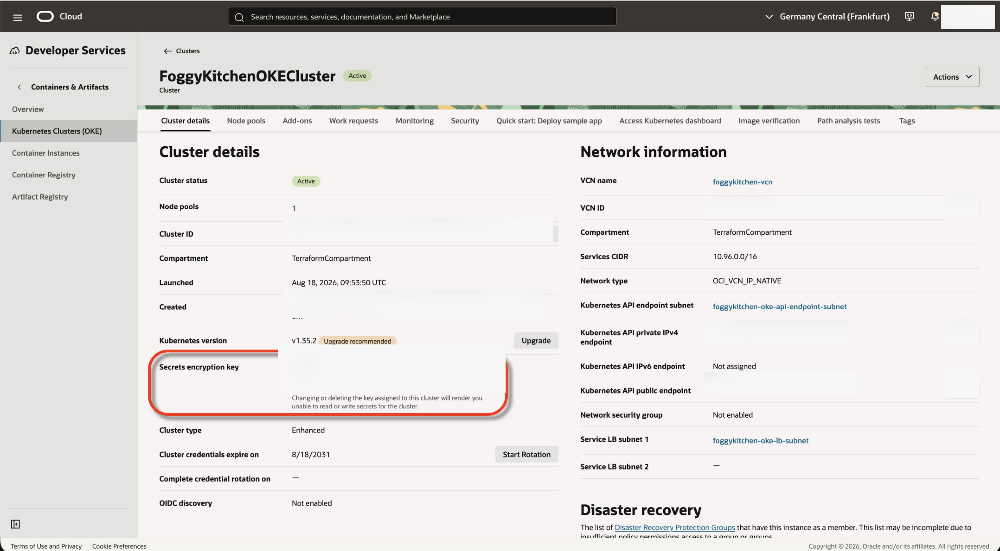
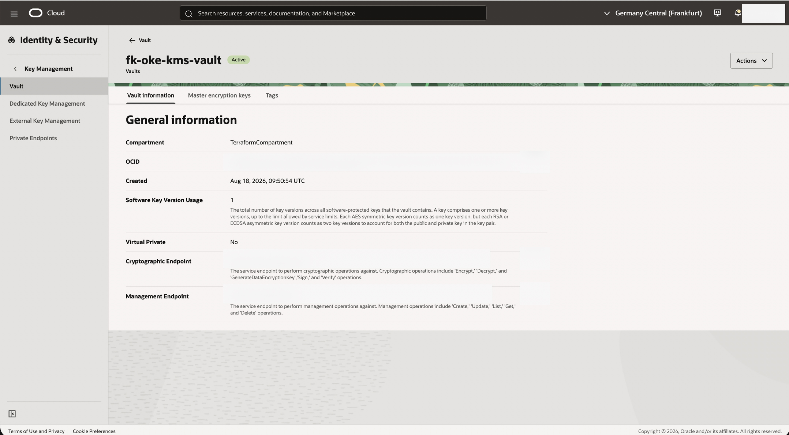

# Lesson 11: Enhanced Cluster with KMS Secret Encryption

This is Lesson 11 from the FoggyKitchen OCI Kubernetes Course. It deploys an enhanced Oracle Container Engine for Kubernetes (OKE) cluster with customer-managed encryption for Kubernetes Secrets by composing `terraform-oci-fk-vcn`, `terraform-oci-fk-vault`, `terraform-oci-fk-policy`, and the local `terraform-oci-fk-oke` module.

It reuses the enhanced-cluster network pattern from Lesson 2 and adds a Vault KMS key plus the IAM policy required for OKE to use that key.

---

## What This Lesson Shows

This deployment plans to create:

- A new OCI VCN created by `terraform-oci-fk-vcn`
- A cluster API endpoint subnet, load balancer subnet, and private node pool subnet using the same pattern as Lesson 2
- An Internet Gateway, NAT Gateway, Service Gateway, and separate public/private route tables created by `terraform-oci-fk-vcn`
- An OCI Vault and one KMS key created by `terraform-oci-fk-vault`, using `vault_type = "DEFAULT"` and `protection_mode = "SOFTWARE"`
- An OCI IAM policy created by `terraform-oci-fk-policy` that allows OKE cluster principals to use the KMS key
- An enhanced OKE cluster created by `terraform-oci-fk-oke` with `kms_key_id` set to the Vault key OCID

The OKE provider argument used here is the top-level `kms_key_id` argument on `oci_containerengine_cluster`. Oracle documents it as the KMS key OCID used as the master encryption key for Kubernetes secret encryption. OKE documentation describes this as encrypting Kubernetes Secrets at rest in the cluster's etcd key-value store using envelope encryption.



---

## Architecture Notes

The network layer is intentionally the same as Lesson 2:

- the API endpoint and load balancer subnets use the public route table
- the node pool subnet is private
- the private route table uses NAT Gateway for outbound internet access and Service Gateway for Oracle Services Network access

For private workload access to OCI Vault APIs, refer to the private-access pattern in `terraform-oci-fk-vault` example `02_vault_with_secret_and_workload`. That pattern uses Service Gateway access to Oracle Services Network, not a Vault Private Endpoint. This lesson does not duplicate that workload-secret access flow; it only creates the key used by OKE for Kubernetes Secret encryption.



The IAM policy is kept in this lesson rather than inside the OKE module because the reusable OKE module does not own IAM policy lifecycle.

---

## Module Composition

The lesson is split into four reusable modules:

- [networking.tf](networking.tf) creates the VCN layer with `terraform-oci-fk-vcn`.
- [vault.tf](vault.tf) creates an OCI Vault and KMS key with `terraform-oci-fk-vault`.
- [iam.tf](iam.tf) creates the OKE-to-key policy with `terraform-oci-fk-policy`.
- [oke.tf](oke.tf) creates the enhanced cluster and passes the KMS key OCID to `kms_key_id`.

```hcl
module "fk-vault" {
  source = "git::https://github.com/foggykitchen/terraform-oci-fk-vault.git?ref=main"

  name             = "fk-oke-kms-vault"
  compartment_ocid = var.compartment_ocid
  vault_type       = "DEFAULT"

  keys = {
    oke-secrets = {
      display_name    = "fk-oke-secrets-key"
      protection_mode = "SOFTWARE"
      key_shape = {
        algorithm = "AES"
        length    = 32
      }
    }
  }
}

module "fk_policy_oke_kms" {
  source = "github.com/foggykitchen/terraform-oci-fk-policy"

  providers = {
    oci = oci.homeregion
  }

  tenancy_ocid = var.tenancy_ocid

  policies = [
    {
      name        = "fk_oke_kms_secret_encryption"
      description = "Policy to allow OKE clusters to use the Vault key for Kubernetes secret encryption"
      statements = [
        "Allow any-user to use keys in compartment id ${var.compartment_ocid} where ALL {request.principal.type = 'cluster', target.key.id = '${module.fk-vault.key_ids["oke-secrets"]}'}"
      ]
    }
  ]
}

module "fk-oke" {
  source = "../.."

  cluster_type     = "enhanced"
  kms_key_id       = module.fk-vault.key_ids["oke-secrets"]
  use_existing_vcn = true

  depends_on = [module.fk_policy_oke_kms]
}
```

The important settings are:

- `terraform-oci-fk-vault` creates a default OCI Vault and software-protected KMS key, then exposes the key OCID through `key_ids`.
- `terraform-oci-fk-policy` creates the policy that allows cluster principals to use that key.
- `kms_key_id = module.fk-vault.key_ids["oke-secrets"]` passes the key OCID into the OKE cluster resource.
- `depends_on = [module.fk_policy_oke_kms]` ensures the IAM policy is planned as a prerequisite for cluster creation.
- `cluster_type = "enhanced"` keeps the lesson on the enhanced OKE path.

---

## Deploy Using Terraform CLI

### Clone The Repository

```bash
git clone https://github.com/foggykitchen/terraform-oci-fk-oke.git
cd terraform-oci-fk-oke/training/lesson11_oke_kms_encryption
```

### Create `terraform.tfvars`

Start from the example file:

```bash
cp terraform.tfvars.example terraform.tfvars
```

Minimum required values:

```hcl
tenancy_ocid     = "ocid1.tenancy.oc1..<your_tenancy_ocid>"
user_ocid        = "ocid1.user.oc1..<your_user_ocid>"
compartment_ocid = "ocid1.compartment.oc1..<your_compartment_ocid>"
region           = "<oci_region>"
fingerprint      = "<fingerprint>"
private_key_path = "<private_key_path>"
```

### Initialize OpenTofu

Use OpenTofu from the lesson directory:

```bash
tofu init
tofu plan
```

If the plan looks correct, it should show the new VCN resources, Vault and KMS key, IAM policy, and enhanced OKE cluster with `kms_key_id` set.

This lesson is intentionally limited to planning so that you can inspect the architecture before any infrastructure is created.

---

## Destroy

If you apply the example later outside the scope of this lesson and want to remove everything created by it:

```bash
tofu destroy
```

---

## Key Takeaways

This example demonstrates:

- How to compose `terraform-oci-fk-vault` with `terraform-oci-fk-oke`
- How to pass a Vault KMS key OCID into OKE through `kms_key_id`
- How to keep OKE-to-Vault IAM policy outside the reusable OKE module
- How customer-managed encryption applies to Kubernetes Secrets stored at rest in etcd

---

## Contributing

This project is open source. Contributions are welcome through pull requests.

---

## License

Licensed under the **Universal Permissive License (UPL), Version 1.0**.
See [LICENSE](../../LICENSE) for details.

---

© 2026 [FoggyKitchen.com](https://foggykitchen.com) - Cloud. Code. Clarity.
