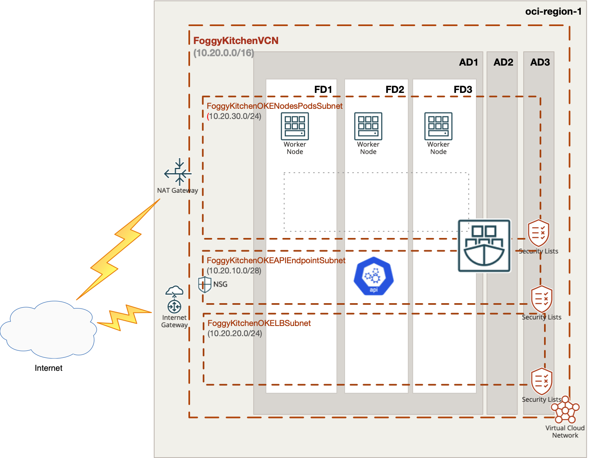
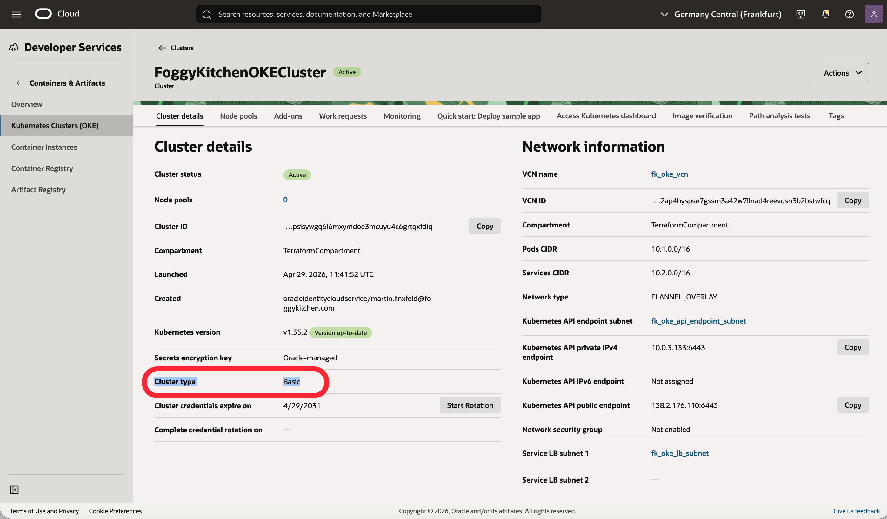

# Lesson 01: Basic OKE Cluster

This is Lesson 1 from the FoggyKitchen [OCI Kubernetes Course](https://foggykitchen.com/courses/oci-kubernetes-course/). It deploys a minimal Oracle Container Engine for Kubernetes (OKE) cluster by composing the reusable `terraform-oci-fk-vcn` and `terraform-oci-fk-oke` modules.

It is intentionally small. The goal is to establish the baseline architecture for the rest of the training track and to stop at `tofu plan`.

---

## What This Lesson Shows



This deployment plans to create:

- A new OCI VCN created by `terraform-oci-fk-vcn`
- A cluster API endpoint subnet created by `terraform-oci-fk-vcn`
- A load balancer subnet created by `terraform-oci-fk-vcn`
- A node pool subnet created by `terraform-oci-fk-vcn`, with worker nodes created by `terraform-oci-fk-oke`
- An Internet Gateway and shared public route table created by `terraform-oci-fk-vcn`
- Security lists for the cluster networking created by `terraform-oci-fk-vcn`
- A basic OKE cluster created by `terraform-oci-fk-oke`

The network layer is created first by `terraform-oci-fk-vcn`.
That includes the VCN, subnets, gateways, route table, and security lists.
The OKE module then consumes the resulting subnet and VCN IDs through `use_existing_vcn = true`.

---

## Architecture Notes

The following screenshot shows the created OKE resources in OCI Console:



---

## Module Composition

The lesson is split into two reusable modules:

- [networking.tf](/Users/mlinxfeld/codes/terraform-oci-fk-oke/training/lesson1_oke_basic_cluster/networking.tf) creates the VCN layer with `terraform-oci-fk-vcn`, including subnets, gateways, route tables, and security lists.
- [oke.tf](/Users/mlinxfeld/codes/terraform-oci-fk-oke/training/lesson1_oke_basic_cluster/oke.tf) creates the cluster with `terraform-oci-fk-oke` and injects the subnet and VCN IDs from the network module.

```hcl
module "fk-vcn" {
  source = "git::https://github.com/foggykitchen/terraform-oci-fk-vcn.git?ref=v0.1.0"

  compartment_ocid = var.compartment_ocid
  name             = "foggykitchen-vcn"
  vcn_cidr_blocks  = ["10.20.0.0/16"]

  create_internet_gateway = true

  route_tables = {
    public = {
      route_rules = [
        {
          destination        = "0.0.0.0/0"
          destination_type   = "CIDR_BLOCK"
          network_entity_key = "internet_gateway"
        }
      ]
    }
  }

  subnets = {
    api_endpoint = {
      cidr_block                 = "10.20.10.0/28"
      route_table_key            = "public"
      prohibit_public_ip_on_vnic = false
    }
    lb = {
      cidr_block                 = "10.20.20.0/24"
      route_table_key            = "public"
      prohibit_public_ip_on_vnic = false
    }
    nodes = {
      cidr_block                 = "10.20.30.0/24"
      route_table_key            = "public"
      prohibit_public_ip_on_vnic = false
    }
  }
}

module "fk-oke" {
  source = "../.."

  tenancy_ocid                  = var.tenancy_ocid
  compartment_ocid              = var.compartment_ocid
  cluster_type                  = "basic"
  k8s_version                   = "v1.35.2"
  node_linux_version            = "8.10"
  node_shape                    = "VM.Standard.A1.Flex"
  node_ocpus                    = 1
  node_memory                   = 4
  use_existing_vcn              = true
  use_existing_nsg              = false
  vcn_id                        = module.fk-vcn.vcn_id
  api_endpoint_subnet_id        = module.fk-vcn.subnet_ids["api_endpoint"]
  lb_subnet_id                  = module.fk-vcn.subnet_ids["lb"]
  nodepool_subnet_id            = module.fk-vcn.subnet_ids["nodes"]
  is_api_endpoint_subnet_public = true
  is_lb_subnet_public           = true
  is_nodepool_subnet_public     = true
}
```

The important settings are:

- `terraform-oci-fk-vcn` creates the VCN, Internet Gateway, route table, security lists, and the three OKE-facing subnets.
- `use_existing_vcn = true` makes `terraform-oci-fk-oke` consume those network resources instead of creating its own.
- `vcn_id`, `api_endpoint_subnet_id`, `lb_subnet_id`, and `nodepool_subnet_id` are injected from `terraform-oci-fk-vcn` outputs into `terraform-oci-fk-oke`.
- `security_list_keys` in `terraform-oci-fk-vcn` attach the `oke_api` and `oke_nodes` security lists to the relevant subnets before OKE is created.
- `cluster_type = "basic"` keeps the lesson on the basic OKE path.
- `is_api_endpoint_subnet_public = true`, `is_lb_subnet_public = true`, and `is_nodepool_subnet_public = true` keep the example reachable in a simple public-network setup.

---

## Deploy Using Terraform CLI

### Clone The Repository

```bash
git clone https://github.com/foggykitchen/terraform-oci-fk-oke.git
cd terraform-oci-fk-oke/training/lesson1_oke_basic_cluster
```

### Initialize OpenTofu

Use OpenTofu from the lesson directory:

```bash
tofu init
tofu plan
```

If the plan looks correct, it should show the new VCN resources from `terraform-oci-fk-vcn` and the OKE resources from `terraform-oci-fk-oke`.

This lesson is intentionally limited to planning so that you can inspect the architecture before any infrastructure is created.

---

## Destroy

If you apply the example later outside the scope of this lesson and want to remove everything created by it:

```bash
tofu destroy
```

---

## Key Takeaways

This example demonstrates:

- How to compose `terraform-oci-fk-vcn` with `terraform-oci-fk-oke`
- How to inject an existing OCI VCN and subnet layout into the OKE module
- The baseline OKE setup used for comparison with the enhanced cluster in Lesson 02

---

## Contributing

This project is open source. Contributions are welcome through pull requests.

---

## License

Licensed under the **Universal Permissive License (UPL), Version 1.0**.
See [LICENSE](../../LICENSE) for details.

---

© 2026 [FoggyKitchen.com](https://foggykitchen.com) - Cloud. Code. Clarity.
