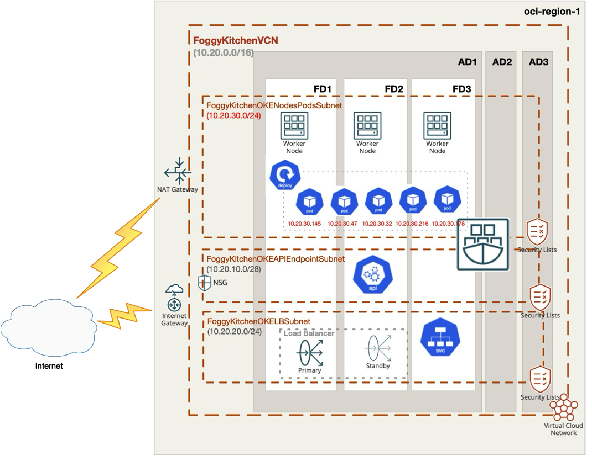
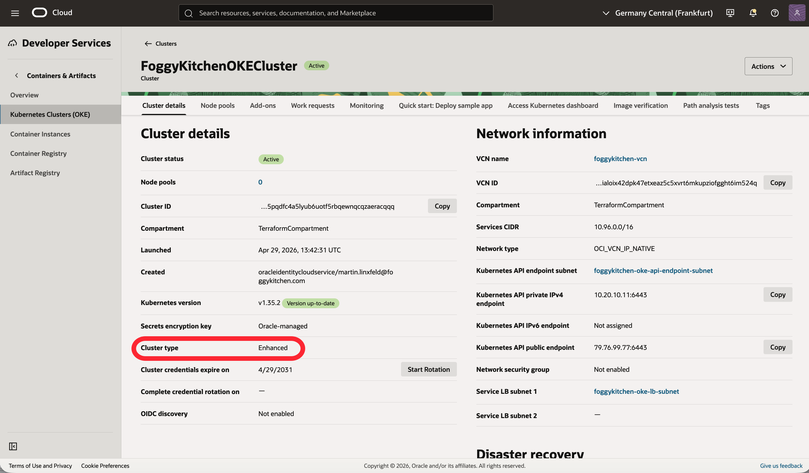

# Lesson 02: Enhanced OKE Cluster

This is Lesson 2 from the FoggyKitchen [OCI Kubernetes Course](https://foggykitchen.com/courses/oci-kubernetes-course/). It deploys an enhanced Oracle Container Engine for Kubernetes (OKE) cluster by composing the reusable `terraform-oci-fk-vcn` and `terraform-oci-fk-oke` modules.

It builds directly on Lesson 1. The main difference is that the cluster runs in `enhanced` mode with `oci_vcn_ip_native = true` and a private node pool subnet.

---

## Architecture Overview



This deployment plans to create:

- A new OCI VCN created by `terraform-oci-fk-vcn`
- A cluster API endpoint subnet created by `terraform-oci-fk-vcn`
- A load balancer subnet created by `terraform-oci-fk-vcn`
- A private node pool subnet created by `terraform-oci-fk-vcn`, with worker nodes created by `terraform-oci-fk-oke`
- An Internet Gateway, NAT Gateway, Service Gateway, and separate public/private route tables created by `terraform-oci-fk-vcn`
- Security lists for the cluster networking created by `terraform-oci-fk-vcn`
- An enhanced OKE cluster created by `terraform-oci-fk-oke`

The network layer is created first by `terraform-oci-fk-vcn`.
That includes the VCN, subnets, gateways, route tables, and security lists.
The OKE module then consumes the resulting subnet and VCN IDs through `use_existing_vcn = true`.

---

## OCI Console View

The following screenshot shows the created OKE resources in OCI Console:



The architecture diagram is conceptual and illustrates the target enhanced OKE topology.
The current lesson implementation uses `terraform-oci-fk-vcn` with security lists and reusable subnet outputs consumed by `terraform-oci-fk-oke`.

---

## Module Composition

The lesson is split into two reusable modules:

- [networking.tf](/Users/mlinxfeld/codes/terraform-oci-fk-oke/training/lesson2_oke_enhanced_cluster/networking.tf) creates the VCN layer with `terraform-oci-fk-vcn`, including subnets, gateways, route tables, and security lists.
- [oke.tf](/Users/mlinxfeld/codes/terraform-oci-fk-oke/training/lesson2_oke_enhanced_cluster/oke.tf) creates the enhanced cluster with `terraform-oci-fk-oke` and injects the subnet and VCN IDs from the network module.

```hcl
module "fk-vcn" {
  source = "git::https://github.com/foggykitchen/terraform-oci-fk-vcn.git?ref=v0.1.0"

  compartment_ocid = var.compartment_ocid
  name             = "foggykitchen-vcn"
  vcn_cidr_blocks  = ["10.20.0.0/16"]

  create_internet_gateway = true
  create_nat_gateway      = true
  create_service_gateway  = true
}

module "fk-oke" {
  source = "../.."

  tenancy_ocid                  = var.tenancy_ocid
  compartment_ocid              = var.compartment_ocid
  cluster_type                  = "enhanced"
  k8s_version                   = "v1.35.2"
  node_linux_version            = "8.10"
  oci_vcn_ip_native             = true
  vcn_native                    = true
  use_existing_vcn              = true
  use_existing_nsg              = false
  vcn_id                        = module.fk-vcn.vcn_id
  api_endpoint_subnet_id        = module.fk-vcn.subnet_ids["api_endpoint"]
  lb_subnet_id                  = module.fk-vcn.subnet_ids["lb"]
  nodepool_subnet_id            = module.fk-vcn.subnet_ids["nodes"]
  pods_subnet_id                = module.fk-vcn.subnet_ids["nodes"]
  is_api_endpoint_subnet_public = true
  is_lb_subnet_public           = true
  is_nodepool_subnet_public     = false
}
```

The important settings are:

- `terraform-oci-fk-vcn` creates the VCN, gateways, route tables, security lists, and the three OKE-facing subnets.
- the public route table uses the Internet Gateway, while the private route table uses NAT Gateway plus Service Gateway access for Oracle services.
- `create_nat_gateway = true` and the private route table keep the node pool subnet private while still allowing outbound access.
- `use_existing_vcn = true` makes `terraform-oci-fk-oke` consume those network resources instead of creating its own.
- `vcn_id`, `api_endpoint_subnet_id`, `lb_subnet_id`, and `nodepool_subnet_id` are injected from `terraform-oci-fk-vcn` outputs into `terraform-oci-fk-oke`.
- `pods_subnet_id` is also injected for `oci_vcn_ip_native = true`, using the same private subnet in this lesson.
- `cluster_type = "enhanced"` switches the module to the enhanced OKE path.
- `oci_vcn_ip_native = true` enables OCI VCN-native pod networking.
- `is_nodepool_subnet_public = false` keeps worker nodes off the public internet.

---

## Deployment Steps

Use OpenTofu from the lesson directory:

```bash
tofu init
tofu plan
```

If the plan looks correct, it should show the new VCN resources from `terraform-oci-fk-vcn` and the enhanced OKE resources from `terraform-oci-fk-oke`.

This lesson is intentionally limited to planning so that you can inspect the enhanced cluster architecture before any infrastructure is created.

---

## Cleanup

If you apply the example later outside the scope of this lesson and want to remove everything created by it:

```bash
tofu destroy
```

---

## Summary

This example demonstrates:

- How to compose `terraform-oci-fk-vcn` with `terraform-oci-fk-oke` for an enhanced cluster
- How to inject an existing OCI VCN and subnet layout into the OKE module
- How to keep the API and load balancer subnets public while keeping the node pool subnet private
- The enhanced OKE setup used as the baseline for later lessons

---

## Learn More

Visit [FoggyKitchen.com](https://foggykitchen.com/) for OCI, multicloud, and Terraform learning resources, including the full [OCI Kubernetes Course](https://foggykitchen.com/courses/oci-kubernetes-course/).

---

## License

Licensed under the Universal Permissive License (UPL), Version 1.0.
See [LICENSE](../../LICENSE) for more details.
